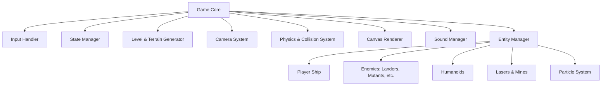
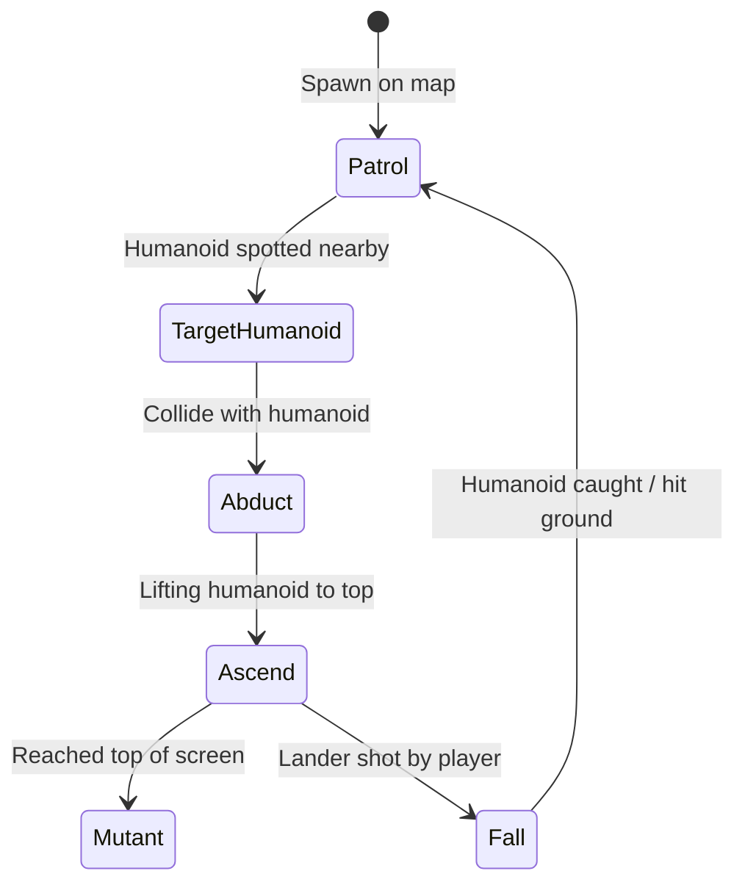

# Architecture & Implementation Guide: Vanilla JS Defender

This document outlines the architecture, systems, and implementation steps required to build a fully functional, high-performance, and visually faithful clone of the classic 1981 arcade game **Defender** using vanilla HTML5 Canvas and JavaScript.

---

## 1. Game Mechanics Summary

Defender is a side-scrolling shoot-'em-up with several distinctive mechanics:
*   **Bi-directional Scrolling World:** The world wraps horizontally. The player can fly left or right, and the screen scrolls accordingly.
*   **Radar/Minimap:** A top-of-screen map showing the full horizontal width of the level, marking the positions of the player, enemies, and humanoids.
*   **Humanoid Abduction:** Landers attempt to grab humanoids from the terrain. If they succeed and reach the top of the screen, they fuse into a fast, aggressive Mutant. The player can shoot the Lander and catch the falling humanoid to return them to the ground.
*   **Planet Destruction:** If all humanoids are killed, the planet explodes (terrain disappears), and all enemies turn into Mutants.
*   **Enemy Hierarchy:** Landers, Mutants, Bombers (drop mines), Pods (burst into Swarmers), Swarmers (fast chasers), and Baiters (fast time-limit enforcement units).
*   **Special Abilities:** Smart Bombs (clear screen) and Hyperspace (teleport to a random, potentially dangerous location).

---

## 2. System Architecture

A modular, clean architecture is key for running a smooth canvas-based game in vanilla JS. We can organize the game around a central `Game` class coordinating several specialized managers and systems:



### Core Systems Details

1.  **Game Loop & State Manager:**
    *   Uses `requestAnimationFrame` for a smooth 60 FPS update-draw cycle.
    *   Tracks game states: `MENU`, `PLAYING`, `LEVEL_COMPLETE`, `PLAYER_DEATH`, `GAME_OVER`.
    *   Tracks player stats: Score, Lives, Smart Bombs, and Active Level.

2.  **Input Handler:**
    *   Listens to keyboard events (`keydown`, `keyup`).
    *   Maps key states dynamically (e.g., `keys['ArrowUp'] = true`) to handle multi-key inputs cleanly.
    *   Supports: Arrow Keys / WASD (Movement), Space (Fire), `B` (Smart Bomb), `H` (Hyperspace).

3.  **Camera & Coordinate Wrapping:**
    *   **World Coordinates:** The game world is much wider than the screen (e.g., world width = 10,000 pixels; viewport width = 800 pixels).
    *   **Horizontal Wrapping:** If an entity's $x$ coordinate goes below $0$, it wraps to `WORLD_WIDTH`. If it goes above `WORLD_WIDTH`, it wraps to $0$.
    *   **Camera Position:** The camera follows the player. The rendered screen coordinate for any entity is calculated as:
        $$\text{screenX} = (\text{entity.x} - \text{camera.x} + \text{WORLD\_WIDTH}) \pmod{\text{WORLD\_WIDTH}}$$
        To prevent clipping at the borders, entities close to the screen edges must be drawn twice (once wrapped).

4.  **Collision System:**
    *   **Spatial Partitioning:** To keep updates efficient, divide the world into vertical sectors (bins) and check collisions only between entities in adjacent sectors.
    *   **AABB or Circular Collisions:** Circular collision boundaries work best for classic vector-style graphics.

5.  **Renderer (HTML5 Canvas):**
    *   Handles retro vector aesthetics (glow effects, neon colors on a black background).
    *   Draws the ground terrain using a jagged line generated by a simple midpoint displacement or static sine wave function.
    *   Renders the Radar (minimap) at the top of the canvas, scaling down the entire `WORLD_WIDTH` to the viewport width.

---

## 3. Entity & Physics Design

All entities inherit from a base `Entity` class.

```javascript
class Entity {
    constructor(x, y, width, height, type) {
        this.x = x;          // World coordinates
        this.y = y;
        this.vx = 0;         // Velocity
        this.vy = 0;
        this.width = width;
        this.height = height;
        this.type = type;    // 'player', 'lander', 'humanoid', etc.
        this.active = true;  // Flag to clean up dead entities
    }

    update(dt, worldWidth) {
        this.x += this.vx * dt;
        this.y += this.vy * dt;
        
        // Wrap horizontally
        if (this.x < 0) this.x += worldWidth;
        if (this.x >= worldWidth) this.x -= worldWidth;
    }
}
```

### The Player Controller
*   **Inertia:** The player doesn't stop instantly. Implement custom drag/friction:
    ```javascript
    this.vx *= 0.95; // drag
    this.vy *= 0.95;
    ```
*   **Thrust:** Pressing Left/Right adds velocity in that direction. The ship sprite/vector flips orientation based on movement direction.

---

## 4. Enemy AI & States

Different enemy types require distinct behaviors, which can be modeled using simple state machines:

### Lander AI

*   **Patrol:** Landers drift slowly horizontally and vertically.
*   **Target Humanoid:** Landers lock on to the nearest un-abducted humanoid and descend toward them.
*   **Abduct / Ascend:** Once in contact, the humanoid is locked to the Lander's position, and they ascend vertically.
*   **Mutant Conversion:** If they reach the top boundary, both entities are removed and replaced by a fast Mutant entity that directly targets the player.

### Mutant / Swarmer AI
*   **Pursuit Behavior:** Simple vector tracking. Calculate the direction vector to the player:
    $$\vec{d} = (x_{\text{player}} - x_{\text{enemy}}, y_{\text{player}} - y_{\text{enemy}})$$
    Normalize this vector and apply speed. Handle wrapping when calculating the shortest distance to the player (the player might be closer via the wrapped edge!).

---

## 5. Visual Effects & Retro Aesthetics

To capture the original arcade vibe:
1.  **Canvas Glow Effects:**
    Using `ctx.shadowBlur` and `ctx.shadowColor` to simulate CRT vector glows:
    ```javascript
    ctx.shadowBlur = 8;
    ctx.shadowColor = "#00ffcc";
    ```
2.  **Particle System:**
    Every explosion spawns 20–30 tiny color-coded pixel particles that fade out and fall under gravity.
3.  **Starfield:**
    A layer of background stars scrolling at half the speed of the camera to create parallax depth.

---

## 6. Implementation Roadmap

Here is a step-by-step path to programming the game:

### Phase 1: Engine Skeleton & Viewport
*   [ ] Set up HTML/CSS with a full-window responsive canvas.
*   [ ] Implement the game loop (`requestAnimationFrame`).
*   [ ] Create the `Input` handler tracking key states.
*   [ ] Build the static jagged terrain generator and coordinate wrapping logic.
*   [ ] Add the `Camera` system moving with keys.

### Phase 2: Player & Basic Physics
*   [ ] Implement player ship with thrust, inertia, and vertical bounds.
*   [ ] Create standard laser projectiles matching player direction.
*   [ ] Implement wrapping drawing logic (drawing entities twice if they cross world boundaries).
*   [ ] Render the top-screen Radar mapping all entities onto a scaled-down canvas area.

### Phase 3: Humanoids & Landers
*   [ ] Spawn static humanoids walking along the peaks and valleys of the terrain.
*   [ ] Add Lander enemies with basic patrolling movement.
*   [ ] Program the abduction state machine (Lander targeting, ascending with humanoid).
*   [ ] Build collision detection between lasers/enemies and player/enemies.
*   [ ] Implement catch-and-save logic for falling humanoids.

### Phase 4: Enemy Variety & AI
*   [ ] Mutants (rapid chasing behavior).
*   [ ] Pods and Swarmers (spawning multiple sub-entities upon destruction).
*   [ ] Bombers leaving stationary mines.
*   [ ] Smart bomb mechanics (clearing active screen entities with a screen-flash effect).
*   [ ] Hyperspace (teleportation logic).

### Phase 5: UI, Sound, & Polish
*   [ ] Add UI elements (Score, Lives, level display, retro game-over screen).
*   [ ] Implement a particle engine for explosions, laser trails, and thrust fire.
*   [ ] Integrate Web Audio API synthesized retro sound effects (lasers, explosions, smart bombs).
*   [ ] Fine-tune gameplay variables (speeds, rates of fire, enemy spawn rates per level).
